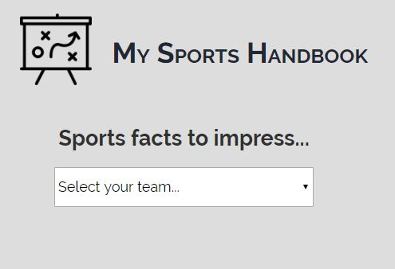
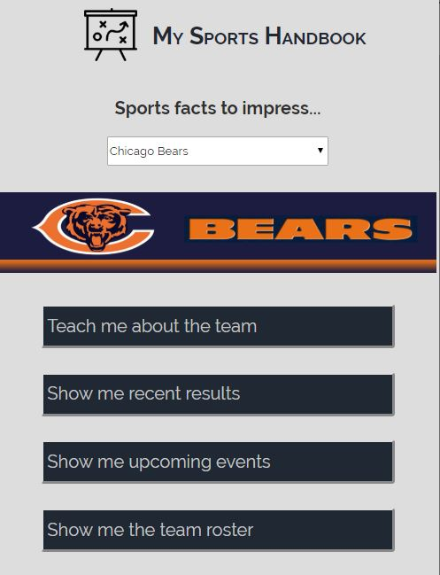

# My Sports Handbook
A tool to allow you to quickly pull information about a specific NFL team including team details,
events, results, highlight reels, a players' roster.

## Motivation
Conversations on Monday and Tuesday at work can be focused on the previous night's football games.  
With a few clicks, you can get up to date on how the game went and see the score and highlight
video.

## Screenshots
### Landing Page

### Select a team

## Overview
www.thesportsdb.com contains information for many different types of leagues.  Within a league there is 
information for: 
1. each team within the league and specific information for the team
2. events for the team, past and future, with results
3. roster for each team
4. information about each team's player

using the developer's API key, the data is incomplete but a good sample for development.  In particular for
this API Hack, the National Football League (NFL) was chosen since its season was in progress during 
development.

## Link to work
 https://g36mitchell.github.io/playbook/
 
## Built with
 HTML, CSS, Javascript, JQuery
 
## Acknowledgements
Thanks to Bob Mitchell and Mike Stanley for testing the tool for me.
